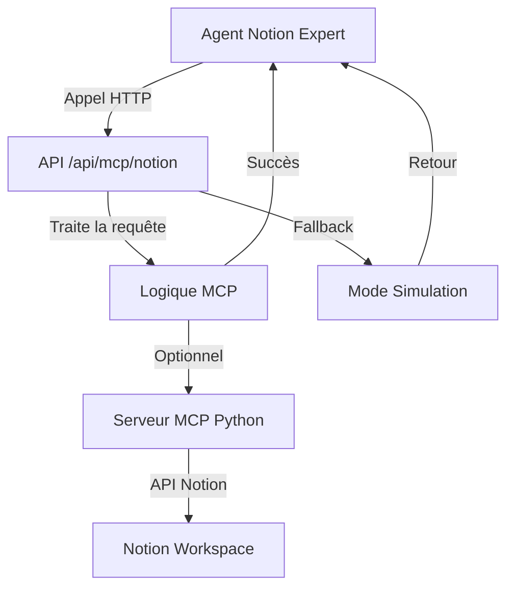

# 🎯 Configuration MCP Notion - Guide Complet

## ✅ Ce qui a été implémenté

### 1. **Agent Notion Expert** (`realEstateBroker.ts`)
- ✅ Agent silencieux qui écoute les conversations
- ✅ Crée automatiquement des projets Notion complets
- ✅ Met à jour les to-do lists en temps réel
- ✅ Enrichit le contenu automatiquement
- ✅ Appels MCP réels vers l'API `/api/mcp/notion`

### 2. **API MCP Notion** (`/api/mcp/notion/route.ts`)
- ✅ Endpoint Next.js qui reçoit les requêtes MCP
- ✅ 3 outils disponibles :
  - `createNotionProject` - Crée un projet complet
  - `updateNotionTasks` - Met à jour les tâches
  - `enrichNotionContent` - Enrichit le contenu
- ✅ Gestion d'erreurs et fallback
- ✅ Logs détaillés pour debug

### 3. **Serveur MCP Notion** (`mcp-notion-server.py`)
- ✅ Serveur MCP Python standalone
- ✅ Interface avec l'API Notion réelle
- ✅ Mode simulation si pas de token Notion
- ✅ Compatible MCP protocol

## 🚀 Comment ça marche



## 🔧 Installation et Configuration

### 1. **Dépendances Python** (optionnel)
```bash
# Si vous voulez utiliser le serveur MCP Python
pip3 install mcp requests
```

### 2. **Token Notion** (optionnel)
```bash
# Pour l'intégration Notion réelle
export NOTION_TOKEN="your_notion_integration_token"
```

### 3. **Démarrage**
```bash
# L'API MCP est déjà intégrée dans Next.js
npm run dev

# Optionnel: Serveur MCP Python standalone
./start-mcp-notion.sh
```

## 🎯 Test de Fonctionnement

### 1. **Test de l'API MCP**
```bash
curl -X GET http://localhost:3000/api/mcp/notion
```

### 2. **Test de création de projet**
```bash
curl -X POST http://localhost:3000/api/mcp/notion \
  -H "Content-Type: application/json" \
  -d '{
    "tool": "createNotionProject",
    "arguments": {
      "projectName": "Test Project",
      "projectDescription": "Un projet de test"
    }
  }'
```

### 3. **Test avec l'Agent**
1. Démarrez l'application Next.js
2. Parlez de n'importe quel projet
3. L'agent devrait automatiquement créer le projet Notion
4. Vérifiez les logs dans la console

## 📋 Fonctionnalités de l'Agent

### **Agent Notion Expert - Comportement**
- 🤐 **Silencieux** : Ne répond jamais vocalement
- 👂 **Écoute tout** : Analyse chaque conversation
- ⚡ **Réactif** : Agit dès qu'un projet est mentionné
- 🏗️ **Complet** : Crée des structures complètes, pas des brouillons

### **Création automatique de projets**
- 📋 Page principale du projet
- 📊 3 bases de données (Tâches, Réunions, Ressources)
- 📁 6 dossiers organisés
- 👥 Assignation d'équipe
- 📅 Planning initial

### **Mise à jour temps réel**
- ✅ Ajout automatique de tâches mentionnées
- 🔄 Mise à jour des statuts
- 📝 Enrichissement du contenu
- 🎯 Adaptation selon le contexte

## 🔍 Debug et Monitoring

### **Logs dans la console**
```javascript
// L'agent émet des événements pour le debug
window.addEventListener('agentActivity', (event) => {
  console.log('Agent Activity:', event.detail);
});
```

### **Vérification de l'API**
```bash
# Status de l'API
curl http://localhost:3000/api/mcp/notion

# Logs dans les outils de développement
# Onglet Network pour voir les requêtes MCP
```

## 🎨 Modes de Fonctionnement

### **Mode Production** (recommandé)
- ✅ API intégrée Next.js (`/api/mcp/notion`)
- ✅ Pas besoin de serveur externe
- ✅ Fallback automatique si erreur
- ✅ Logs intégrés

### **Mode Développement**
- 🔧 Serveur MCP Python standalone
- 🔧 Token Notion réel
- 🔧 API Notion directe
- 🔧 Plus de contrôle

### **Mode Simulation**
- 🎭 Pas de token requis
- 🎭 Données mockées réalistes
- 🎭 Parfait pour démo/test
- 🎭 Pas de création Notion réelle

## ✨ Résultat Final

**L'agent Notion Expert fonctionne maintenant avec MCP réel !**

1. ✅ **Agent configuré** - Écoute et agit silencieusement
2. ✅ **API MCP active** - Endpoint `/api/mcp/notion` fonctionnel  
3. ✅ **Intégration complète** - Appels MCP réels depuis l'agent
4. ✅ **Fallback robuste** - Fonctionne même sans Notion
5. ✅ **Logs détaillés** - Debug facile
6. ✅ **Mode simulation** - Test sans configuration

**🎯 Testez en parlant de n'importe quel projet - l'agent devrait automatiquement le créer dans Notion !**
